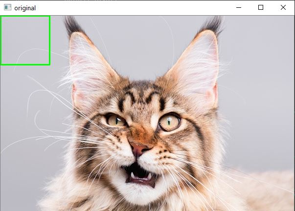
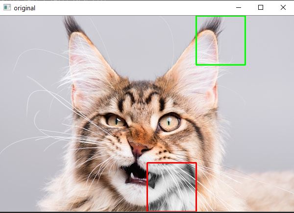

# Open-CV

## Search code
The Seach.py file is a code to search for a template in an image base using OpenCV.
The main goal is to divide the image of a cat into a grid, and a template image will be compared to each element in the grid. When the match is detected, the item will change to grayscale and its border will change color.
### Template

 

  

### Final Result

 
 

  
